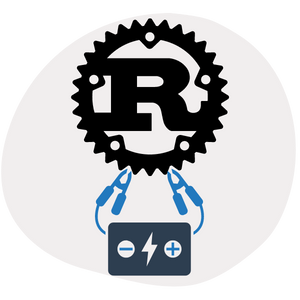

<p align="center">
  <a href="" rel="noopener">
 </a>
</p>

<h3 align="center">Rust Starter</h3>

<div align="center">

[]()


</div>

---


<p align="center"> Rust Starter
    <br> 
</p>

## 📝 Table of Contents

- [📝 Table of Contents](#-table-of-contents)
- [🧐 About <a name = "about"></a>](#-about-)
- [Getting Started <a name = "getting_started"></a>](#getting-started-)
  - [Prerequisites](#prerequisites)
  - [Installation <a name = "installation"></a>](#installation-)
  - [Installation on Ubuntu 20.04 in WSL2](#installation-on-ubuntu-2004-in-wsl2)
- [Build tool and Package Manager <a name = "build"></a>](#build-tool-and-package-manager-)
- [Development Environment <a name = "devenv"></a>](#development-environment-)
- [First Project <a name = "firstproject"></a>](#first-project-)
- [Projects <a name = "projects"></a>](#projects-)
- [Usage <a name = "usage"></a>](#usage-)
- [⛏️ Built Using <a name = "built_using"></a>](#️-built-using-)
- [✍️ Authors <a name = "authors"></a>](#️-authors-)


## 🧐 About <a name = "about"></a>

This is a Rust-101 Repository covering basics of Rust Programming Language leading to some networking and async development basics in Rust.

## Getting Started <a name = "getting_started"></a>

These instructions will get you a copy of the project up and running on your system. 


### Prerequisites

```
- Ubuntu 20.04
```

* The projects in this repository are tested on Ubuntu 20.04 running on WSL2 on Windows 11.

### Installation <a name = "installation"></a>

A step by step instructions on installing and configuring Rust on Ubuntu 20.04.

### Installation on Ubuntu 20.04 in WSL2

  1. Open the terminal and execute the following commands
   

  ```curl --proto '=https' --tlsv1.2 -sSf https://sh.rustup.rs | sh```
  
  1.  Then update the Rust to the latest version using
   
  ```rustup update```


## Build tool and Package Manager <a name = "build"></a>

Rust use `cargo` that is a build tool and pacakge manager just like `npm` in NodeJS and `pip` in python.

There are few basics `cargo` command arguments listed below

- `cargo build` {to build a project}
- `cargo run` {to run a project}
- `cargo test` {to test a project}
- `cargo doc` {to build documentations}
- `cargo publish` {to publish a libarary to cartes.io}
- `cargo --version` {check the version number of cargo}

## Development Environment <a name = "devenv"></a>

One can use a text/code editor or their choice to work on a Rust project. I use VSCode for all of my project.

- [VSCode Rust Extension](https://marketplace.visualstudio.com/items?itemName=rust-lang.rust)


## First Project <a name = "firstproject"></a>

To create a new Rust project follow the instructions below.

1.  Open the terminal and execute the following commands

- `cargo new hello-world`

This will create a new directory named *hello-world* with the following files

1.  ``Cargo.toml`` {manifest file for Rust. Stores metadata related to the project}
2.  ``src/main.rs`` {main application file}


You can now run the project using

- `cargo run`

The above command will output `Hello, world!`

## Projects <a name = "projects"></a>

1.  Hello World(hello-world) {Hello World Example}
2.  Hello Basics(hello-basics) {Rust Basics - Functions, DataTypes...}
3.  Dependencies(hello-deps) {Dependencies Usage Example}
4.  [Basic MQTT(hello-mqtt)](https://github.com/Nauman3S/Rust-Starter/tree/main/hello-mqtt) {Networking - MQTT Basic Publisher Example}

## Usage <a name = "usage"></a>


## ⛏️ Built Using <a name = "built_using"></a>

- [Rust](https://www.rust-lang.org/) - Programming Language

## ✍️ Authors <a name = "authors"></a>

- [@Nauman3S](https://github.com/Nauman3S) - Software and Electrical Engineer
